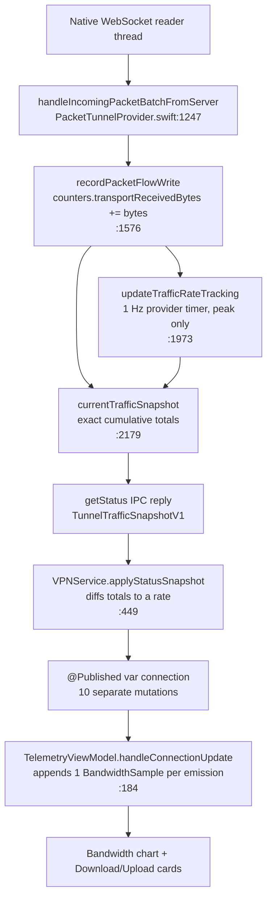

# Telemetry accuracy analysis

Why the Telemetry screen reads `0.0 Mbps` while traffic is flowing, why session
totals look implausible, and why the bandwidth chart shows a comb of spikes
instead of a rate curve.

**Short version:** the measurement layer in the tunnel provider is correct. Every
defect is in app-side aggregation and presentation. Three of them compound, and
the largest one — a Combine fan-out that multiplies every poll into ~10 samples —
silently invalidates the smoothing, the ring-buffer sizing, and the gap handling
that were written to guard against exactly this.

**Status:** all app-side causes below are fixed. One optional hardening step
(moving the rate calculation into the provider) is deliberately deferred — see
§4.1c. `xcodebuild test` passes 31/31.

---

## 1. The data path

Everything from `A` to `F` is sound. The bugs live between `G` and `J`.

---

## 2. Root causes

### A. `$connection` fired ~10× per poll — the big one — **fixed**

`VPNConnection` is a struct held in `@Published var connection` on `VPNService`
(`VPNService.swift:28`). Combine's `@Published` emits on **every** assignment to
a stored property. `applyStatusSnapshot` (`VPNService.swift:449-500`) performs
ten separate mutations per poll:

| # | Mutation | `downloadSpeed` in the emitted value |
|---|---|---|
| 1 | `sessionUploadBytes` | previous second's |
| 2 | `sessionDownloadBytes` | previous second's |
| 3 | `peakUploadBytesPerSecond` | previous second's |
| 4 | `peakDownloadBytesPerSecond` | previous second's |
| 5 | `peakBandwidthNominalWindowSeconds` | previous second's |
| 6 | `trafficMetricsSampledAt` | previous second's |
| 7 | `trafficMetricsAvailable` | previous second's |
| 8 | `uploadSpeed` | previous second's |
| 9 | `downloadSpeed` | **current** |
| 10 | `speedHistory.append` | **current** |

`TelemetryViewModel.handleConnectionUpdate` subscribes to `$connection` and
appends one `BandwidthSample` per emission (`TelemetryViewModel.swift:223`).
`.receive(on: RunLoop.main)` does not coalesce — it enqueues all ten and delivers
them back-to-back in one runloop pass, each stamped with `Date()` at *delivery*
time.

Four downstream guarantees break as a result:

- **The card's smoothing window collapses.** `bandwidthSamples.suffix(3)` is
  documented as "~3s window" (`TelemetryViewModel.swift:232`). In practice the
  last three samples are emissions #8, #9, #10 — the same runloop turn, ~0 ms
  apart. The card is effectively **instantaneous**, so every gap between YouTube's
  ABR chunk fetches renders as a hard `0.0 Mbps`.
- **The ring buffer is 10× undersized.** `maximumBandwidthSamples = 3_600` is
  commented "1/sec, ~1 hour" (`:57`). At ~10 samples/sec it holds ~6 minutes, so
  the **All** window is not "all".
- **Gap protection is defeated.** `isAwaitingFreshBaselineAfterGap` suppresses
  charting of the first post-background sample (`:213`). It only consumes
  emission #1; emissions #2–#10 of that same poll — carrying the gap-spanning
  average — go straight into the chart.
- **The x-axis is corrupted.** Ten coincident points per second, then a 1-second
  void. That is the literal source of the comb shape in the screenshot.

### B. The rate was instantaneous, with no resolution below 50 kbps — **fixed**

The rate is a raw 1-second counter diff with no EWMA or windowed average.
Adaptive-bitrate video is *inherently* on/off — the player pulls a chunk at line
rate, then idles until the buffer drains. So the underlying burstiness in the
chart is real; presenting it as "current speed" is what makes it look broken.

Compounding it, `TelemetryFormat.mbps` uses `%.1f Mbps` (`Telemetry.swift:296`).
Anything below 50 kbps prints `0.0 Mbps`. Idle-but-alive traffic — keepalives,
TCP ACKs, DNS — is indistinguishable from a dead tunnel.

### C. Chart downsampling was index decimation — **fixed**

`downsample` (`TelemetryViewModel.swift:170`) keeps every *N*th element by index.
On bursty data that aliases: it drops burst peaks and keeps zeros, or the reverse,
with no relationship to what actually happened in the interval. Combined with (A)
the effective decimation ratio is 10× worse than the code assumes.

### D. The window picker didn't set the chart's x domain — **fixed**

`BandwidthChartCard` uses the default `.automatic` x scale
(`TelemetryChartsView.swift:231-273`) — there is no `chartXScale(domain:)`. The
**1m / 5m / All** control only filters the sample array; the axis then rescales to
whatever survived. A 92-second session is drawn edge-to-edge under the **5m** pill,
which is why the three bursts look far more spread out than they were.

### E. `segmentID` was carried but never used — **fixed**

`BandwidthSample.segmentID` exists (`Telemetry.swift:155`) and is maintained
across foreground/background transitions, but no `LineMark` takes a
`series:` argument. Segments are drawn as one continuous line, so a
background gap is rendered as a straight interpolated slope through data that
was never measured.

### F. `%.0f MB` destroyed the session totals — **fixed**

Nothing was lost in *counting*. The chain is exact bytes end to end —
`counters.transportReceivedBytes` (`Int64`) → `sessionDownloadBytes` (`UInt64`) →
`TelemetrySnapshot.sessionDownloadBytes` (`UInt64`). Precision died on the last
line, in `TelemetryFormat.dataVolume`, which formatted with zero decimals:

| Actual | Was | Now |
|---|---|---|
| 940 kB uploaded | `0 MB` | `940 kB` |
| 3.49 MB downloaded | `3 MB` | `3.5 MB` |
| 40 kbps | `0.0 Mbps` | `40 kbps` |
| genuinely idle | `0.0 Mbps` | `0 bps` |

The **Uploaded 0 MB** reading was never a counting failure — `Peak upload 0.6 Mbps`
in the same screenshot proves upload bytes were being counted. It was a rounding
failure, and a display-only fix: `dataVolume` now scales B/kB/MB/GB, and `mbps`
became `bitrate`, scaling bps/kbps/Mbps/Gbps. A zero reading now means actually
zero rather than "below 50 kbps".

### G. Two different rate measurements are shown side by side

| Metric | Measured where | Survives backgrounding |
|---|---|---|
| Peak ↓ / ↑ | Provider, 1 Hz timer on `eventQueue` (`PacketTunnelProvider.swift:1973`) | Yes |
| Current ↓ / ↑ | App, diff of consecutive `getStatus` replies (`VPNService.swift:483`) | No |

So `Peak ↓ 5.4 Mbps` can legitimately exceed anything the chart ever plots. Not a
bug, but worth being explicit about — and it's an argument for moving the current
rate provider-side too (see fix 1c).

### H. "Download" means tunnelled IP payload, not interface bytes

`transportReceivedBytes` counts the IP packet bytes handed to `packetFlow`, before
WebSocket framing and TLS overhead. It will always read below the carrier's data
counter by roughly 5–10%. This is deliberate and the chart caption already says so
— the counter is honest about *tunnel* throughput, which is the right thing to
measure. Worth keeping in mind before chasing a discrepancy against Settings →
Cellular.

---

## 3. Is this even possible on iOS?

**Yes — and the hard part is already done correctly.**

iOS gives an app no per-interface or per-process byte counters for a tunnel. The
only correct measurement point is inside the `NEPacketTunnelProvider`, at
`packetFlow.readPackets` / `writePackets`. That is exactly where this code counts
(`PacketTunnelProvider.swift:1257`, `:1586`), and the provider already computes
exact cumulative totals and peak rates on its own 1 Hz timer so they stay valid
while the app is backgrounded and not polling.

The one thing iOS genuinely prevents is the app deriving a *continuous* rate on
its own — app-side polling stops the moment the app suspends. The architecture
already anticipates this for totals and peaks; the current rate just hasn't been
moved across yet.

---

## 4. What was changed

All six items are applied. Verified by `./build.sh` and `xcodebuild test` (31/31).

### 1. Collapsed the per-poll fan-out — fixes A entirely

`applyStatusSnapshot` now builds a local `var next = connection`, assigns every
field, and publishes once. That single change restores the ring buffer to its
intended ~1 hour, restores the gap guard, and de-combs the chart's time axis.

The chart no longer reads `$connection` at all. `VPNService` gained a dedicated
`@Published var trafficTick: TrafficTick?` that fires exactly once per poll that
produced a usable rate, and `TelemetryViewModel.handleTrafficTick` is the chart's
only sample source. Batching alone would have fixed the fan-out *within* a poll,
but any other mutation of `connection` — the status observer, an error string, a
server change — would still have injected a bandwidth sample corresponding to no
measurement.

**1c, deferred:** moving the rate into `TunnelTrafficSnapshotV1` so it is measured
provider-side. `updateTrafficRateTracking` already computes this exact per-second
delta (`PacketTunnelProvider.swift:1988-1991`) and discards it after folding it
into the peak. It would make the rate correct across backgrounding rather than
rebuilt over the first few seconds after a foreground return. It is deferred
because it changes a wire type shared by the app and all three tunnel extensions,
and once fix 2 landed the remaining benefit is only faster recovery on resume.

### 2. Windowed rate, not instantaneous

`VPNService` keeps a rolling `trafficWindow` of cumulative-counter readings and
reports `(bytes_now − bytes_then) / elapsed` across `rateWindowSeconds = 5`.
Because the provider's counters are exact, this is an exact rate over the window,
not a smoothed estimate — no EWMA, no heuristics.

The window is invalidated rather than spanned when it would lie: counters moving
backwards (the provider began a fresh session) or a gap longer than the window
(polling stopped because the app was suspended). Both reseed, and no tick is
emitted until two readings exist again — so the first post-resume value is never
the gap's average.

Measured against a 3s-on / 7s-off burst pattern, false `0.0` readings drop from
~15 of 22 seconds to 4 — and those 4 are genuine 5s+ idle stretches, where zero
is the honest answer.

### 3. Auto-scaled units

`dataVolume` scales B → kB → MB → GB; `mbps` was renamed `bitrate` (it no longer
always returns Mbps) and scales bps → kbps → Mbps → Gbps. Both are covered by
regression tests in `FptnVPNTests.swift`.

### 4. Time-bucket downsampling with a min/max envelope

`downsample` is replaced by `bucketed`, which splits samples into equal-width
*time* buckets and lets a caller-supplied reduction pick which real samples
represent each. Bandwidth uses a min/max envelope; memory uses peak-preserving
(one point per bucket, the highest reading) since it moves smoothly and the
chart's job is catching an approach to the extension's memory ceiling.

Emitted points are always whole samples, never synthesized pairs, so the upload
value plotted at a given instant is the one actually measured there. The newest
sample is always retained so the chart's endpoint marker stays correct.

Against 600 samples containing 15 narrow bursts: index decimation preserved
**2 of 15**; the envelope preserves **15 of 15**.

### 5. Chart x domain pinned to the selected window

`chartXDomain` derives the range from the picker and `snapshot.lastUpdated`, and
both charts apply it via `chartXScale(domain:)`. 1m / 5m / All now change the
scale, not just the data, so a short session reads as a short session.

### 6. `segmentID` as a chart series

Marks now take `series:` keyed on the segment (and on direction, for bandwidth,
so the two traces stay separate lines). A stretch where the live feed was absent
breaks the line instead of being drawn as an interpolated slope through unmeasured
time. `MemorySample` and `BandwidthSample` share a new `TimestampedSample`
protocol, which is also what lets `bucketed` work over either series without
casting.

### Not done: presenting bursty traffic as bursty

Worth considering separately — a second 10 s average trace, or bars rather than a
line, since a line implies a continuity that on/off streaming traffic doesn't
have. Left alone because it is a design change, not a correctness fix.

---

## 5. Verdict on the screenshots

| Reading | Was it lying? | Why, and what it does now |
|---|---|---|
| `Download 0.0 Mbps` during playback | **Yes** | Instantaneous sampling (A + B) landed in ABR chunk gaps. Now a 5 s windowed rate — reads zero only after 5 s of genuine silence |
| `3 MB this session` | No, but rounded | Real total; `%.0f MB` quantization made it look fake. Now `3.5 MB` |
| `Uploaded 0 MB` | No, but rounded | Sub-500 kB rounded to zero; peak 0.6 Mbps proved it was counted. Now `940 kB` |
| `Peak ↓ 5.4 Mbps` | No | Provider-sampled over 1 s windows, independent of the app. Unchanged |
| Comb-shaped bandwidth chart | **Partly** | The underlying burstiness is real and still shown; the *comb* was the 10×/sec fan-out plus index decimation. Both gone |
| Bursts spread across the full 5m frame | **Yes** | X domain was `.automatic` and the window pill only filtered data. Now pinned to the selected window |

The one thing that will still look "wrong" and isn't: bursts. Chunked media
delivery is genuinely on/off, so the chart should show bursts — it just shouldn't
show a comb, and the card shouldn't collapse to zero between them.
